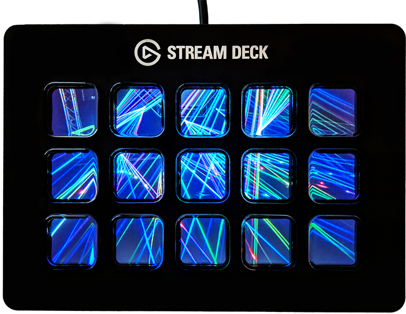

<!--

Keep in mind that this README is for OpenMacroBoard.SDK and for the website.
It's a bit of a compromise because I'm lazy and don't want to write two READMEs

-->
## What is OpenMacroBoard
OpenMacroBoard (maintained by [Christian Franzl](https://github.com/wischi-chr)) provides a few libraries,
that help you implement custom functionality for various macro boards
with focus on devices with key displays.
At the moment OpenMacroBoard is for developers only and there is no easy-to-use
software or installer - just a bunch of libraries ;-)

## Quick Start
Create a new console project in Visual Studio (>= .NET 6), add the NuGet package [`OpenMacroBoard.SDK`](https://www.nuget.org/packages/OpenMacroBoard.SDK/) and at least one device provider.

In this example we use
  - [`OpenMacroBoard.SocketIO`](https://www.nuget.org/packages/OpenMacroBoard.SDK) to support the `VirtualMacroBoard`
  - [`StreamDeckSharp`](https://www.nuget.org/packages/StreamDeckSharp) to support the [Elgato Stream Deck family](https://www.elgato.com/de/de/s/welcome-to-stream-deck)  
    <sub>_**Note**: Neither OpenMacroBoard nor StreamDeckSharp are made or endorsed by Elgato_</sub>

Once you added the NuGet packages copy-paste the following lines:

<!--coderef:getting-started|..\OpenMacroBoard.ExampleCollection\src\OpenMacroBoard.Examples.GettingStarted\Program.cs|csharp-->
```csharp
using OpenMacroBoard.SDK;
using OpenMacroBoard.SocketIO;  // for VirtualMacroBoard
using StreamDeckSharp;          // for StreamDeck

// create a device context (fluent API)
// and add listener for devices (device provider)
using var ctx = DeviceContext.Create()
    .AddListener<SocketIOBoardListener>()   // VirtualMacroBoard
    .AddListener<StreamDeckListener>()      // StreamDeck
    ;

Console.WriteLine("Waiting for a device... (press Ctrl+C to cancel)");
using var board = await ctx.OpenAsync();
Console.WriteLine("Device found.");
Console.WriteLine("1) Try to press some buttons on the device.");
Console.WriteLine("2) Press any key in this console to end the demo.");

// react to key press event by setting a random color
board.KeyStateChanged += (sender, arg) => board.SetKeyBitmap(arg.Key, GetRandomColorKey());

// Wait for a key press in the console window to exit
// the application and disconnect the device.
Console.ReadKey();

// Helper function to create a random color KeyBitmap
static KeyBitmap GetRandomColorKey()
{
    var r = GetRandomByte();
    var g = GetRandomByte();
    var b = GetRandomByte();

    return KeyBitmap.Create.FromRgb(r, g, b);
}

// Helper function to get a random byte
static byte GetRandomByte()
{
    return (byte)Random.Shared.Next(255);
}
```
<!--coderef:end-->

## Plans for the (probably very far) future
I'd like to write an open source alternative for the Elgato Stream Deck software, that supports more devices and lets developers write functions/plugins/widgets for all devices with an existing `IMacroBoard` provider. If you want to help feel free to contact me (just create a ticket or send me a mail).

## Providers and supported devices
Providers are libraries that manage the communication to the macro boards.
This abstraction is needed to allow third parties to implement devices without changes to the core functionality.

At the moment there are just two providers that are maintained by me.

### StreamDeckSharp
First things first, StreamDeckSharp is not official software by Elgato, nor is it endorsed by them.

NuGet: [`StreamDeckSharp`](https://www.nuget.org/packages/StreamDeckSharp/)

| Device	| Description	|
| ---	| ---	|
| [Stream Deck](https://www.elgato.com/de/gaming/stream-deck)	| 5 x 3	|
| Stream Deck Rev2 <sup>1</sup>	| 5 x 3	|
| Stream Deck MK2	| 5 x 3	|
| Stream Deck XL | 8 x 4 |
| Stream Deck XL Rev2 <sup>1</sup> | 8 x 4 |
| [Stream Deck Mini](https://www.elgato.com/de/gaming/stream-deck-mini)	| 3 x 2	|
| Stream Deck Mini Rev2 <sup>1</sup> | 3 x 2	|

<sup>1</sup> New revisions are typically not even marketed as something new, but they often differ in their protocol and USB product IDs.

### OpenMacroBoard.SocketIO
NuGet: [`OpenMacroBoard.SocketIO`](https://www.nuget.org/packages/OpenMacroBoard.SocketIO)

| Device	| Description	|
| ---	|  ---	|
| VirtualBoard	| Software emulated board with arbitrary key configuration	|

## Is device _XYZ_ supported?
If I find the time I'd love to add more, but you can also implement one yourself by referencing `OpenMacroBoard.SDK` and writing a class that implements `IObservable<DeviceStateReport>`. This class can then be added as a device listener in a `DeviceContext`.
If you want me to implement it, you can donate hardware (or the money so I can buy that specific hardware you want implemented) - just create a ticket and we talk about it ;-)

## Examples
You can find a lot of examples in our [example collection](https://github.com/OpenMacroBoard/OpenMacroBoard.ExampleCollection)

Here are a few impressions



[](http://www.youtube.com/watch?v=tNwUG0sPmKw)  
_*The glitches you can see are already fixed._

## Details
For more details and information please visit the [github repositories](https://github.com/OpenMacroBoard).
