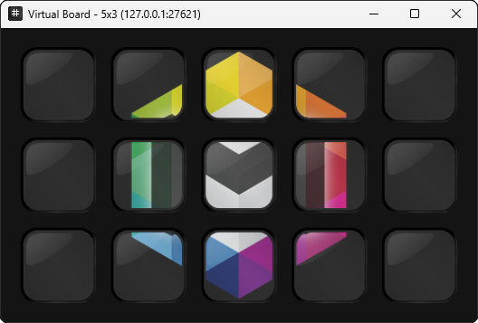
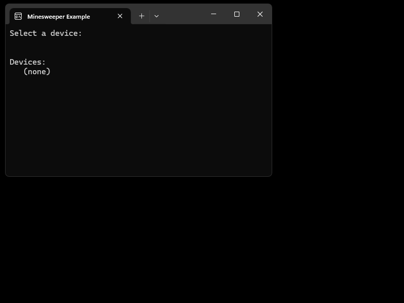

# Virtual Board
Virtual Board is a virtual macro board that allows developers to test software that targets `IMacroBoard`s from the `OpenMacroBoard.SDK` without any actual hardware.

To connect a virtual board you have have to first register the SocketIO device provider (see [homepage](https://openmacroboard.github.io/) "Quick Start" section).
Once you launch `VirtualBoard` it connects to the SocketIO device driver and you can use it like any other macro board.
You can even simulate disconnects and reconnects by opening and closing the application.

Without any CLI parameters, the device starts to listen on port `27621` (binds locally to `127.0.0.1:27621`)
and with a classical Stream Deck configuration (5x3 keys, 72px square keys, 25px gap) and looks a bit like so

Once you started some application that uses `IMacroBoard`s (for example the [Minesweeper](https://github.com/OpenMacroBoard/OpenMacroBoard.ExampleCollection/tree/master/src/OpenMacroBoard.Examples.Minesweeper) example)
you can use it just by clicking with your mouse.

## CLI Parameters
There a few things you can configure with the VirtualBoard application with some CLI parameters (they are all optional)

| Parameter&nbsp;&nbsp;&nbsp;&nbsp;&nbsp;&nbsp;&nbsp;&nbsp;&nbsp;&nbsp;&nbsp;&nbsp;&nbsp;&nbsp;&nbsp;&nbsp;&nbsp;&nbsp;&nbsp;&nbsp;&nbsp;&nbsp;&nbsp;&nbsp;&nbsp;&nbsp;&nbsp;&nbsp; | Default&nbsp;&nbsp;&nbsp;&nbsp;&nbsp;&nbsp;&nbsp;&nbsp;&nbsp;&nbsp;&nbsp;&nbsp;&nbsp;&nbsp;&nbsp;&nbsp;&nbsp;&nbsp;&nbsp; |Description |
| --- | --- | --- |
| `--port <number>` | `27621` | The port number used by VirtualBoard. Port numbers are used to distinguish between boards. There can only be one instance running with a given port, but you can run multiple instances with different board sizes on different ports so simulate multiple devices.  |
| `--device-name <name>` | `Virtual Board` | The name that is shown in the title bar and used for the macro board device name in `OpenMacroBoard.SDK` |
|`--keysx <count>`| `5` | Key count in X direction (columns) |
|`--keysy <count>` | `3` | Key count in Y direction (rows) |
|`--keysize <size>`| `72` | Image size for keys in pixels. |
|`--keygap <size>`| `25` | Gap between keys in pixels. |
| `--binding <ip>` | `127.0.0.1` | The binding IP address. Theoretically you could bind to `0.0.0.0` to even run the virtual device on a different device (on the same network), but I haven't really tested that and there is no support/guarantee that this works.
| `--hide-ip-titlebar` |  | Hides the IP (and port) from the window title bar |

## Download
You can download it pre-build as a Windows x64 binary from the latest release:  
https://github.com/OpenMacroBoard/OpenMacroBoard.SDK/releases

If you need it for any other platform than win-x64 you have to checkout the source and compile it.